## 环境	

|||Mac (local)|Bitahub|Server|
|--------|--------------|--------------------------|--------------------------|--------------------------|
|硬件环境|CPU（vCPU数目）|6|2|idk|
||GPU(型号，数目)|无|gtx1080Ti，1|A100，1|
|软件环境|OS版本|macOS Catalina|Ubuntu|Ubuntu 20.04|
||深度学习框架<br>python包名称及版本|Pytorch1.5 & Python3.7.4|Pytorch1.5 & Python|Pytorch 1.7 & python 3.8.0|
||CUDA版本|无|10.1|11.0|
||||||

## 实验流程

大体流程为，先在mac上测试程序没有bug，然后写shell脚本将所有流程整合并上传到bitahub平台进行运行。

0. 给bitahub配置环境（自己想办法弄[dockerfile](resources/dockerfile)）「吐槽一句，bitahub网好不稳定」

1. 运行MNIST样例程序

2. 修改样例代码，保存网络信息，并使用TensorBoard画出神经网络数据流图。

   1. 首先添加代码段

      ```python
      writer = SummaryWriter(args.output)
      ...
      if args.save_graph:
              writer.add_graph(model, data)
      ```

   2. 使用如下指令开始运行

      ```shell
      python mnist_stu.py --dataset DATASET --save-graph --output OUTPUT
      ```

3. 记录并保存训练时正确率和损失值，使用TensorBoard画出损失和正确率趋势图。

   1. 添加代码段

      ```python
      # 在train、函数里
      if batch_idx % args.log_interval == 0:
          # 已经进行tb画图了，所以这里注释掉
        # print('Train Epoch: {} [{}/{} ({:.0f}%)]\tLoss: {:.6f}'.format(
          #     epoch, batch_idx * len(data), len(train_loader.dataset),
          #     100. * batch_idx / len(train_loader), loss.item()))
          if args.save_scalar and batch_idx != 0:
              writer.add_scalar('training loss', running_loss / args.batch_size * args.log_interval, epoch * len(train_loader)+ batch_idx)
              writer.add_scalar('training_accuracy', correct / args.batch_size * args.log_interval, epoch * len(train_loader) + batch_idx )
          ...
      ```

   2. 使用如下指令开始运行

      ```shell
      python mnist_stu.py --dataset DATASET --save-scalar --output OUTPUT
      ```

4. 添加神经网络分析功能

   1. 添加代码段

      ```python
      if args.profile:
          with torch.autograd.profiler.profile(use_cuda=use_cuda) as prof:
              model(data[0].reshape(1, 1, 28, 28))
          print(prof.key_averages().table(sort_by="self_cpu_time_total", row_limit=10))
      ```

   2. 使用如下指令运行

      ```shell
      python mnist_stu.py --profile --dataset DATASET --output OUTPUT
      ```

   3. 更改batch_size进行运行

      ```shell
      python mnist_stu.py --profile --dataset DATASET --output OUTPUT -batch_size 16
      ```

5. 撰写[脚本](src/run_all.sh)，并上传到bitahub进行运行和测试

## 实验结果

这里展示上传bitahub后的一键脚本跑出的结果。

#### 1.模型可视化

##### 神经网络数据流图

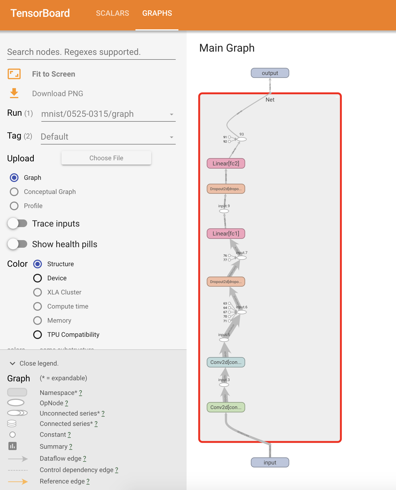

##### 损失和正确率趋势图

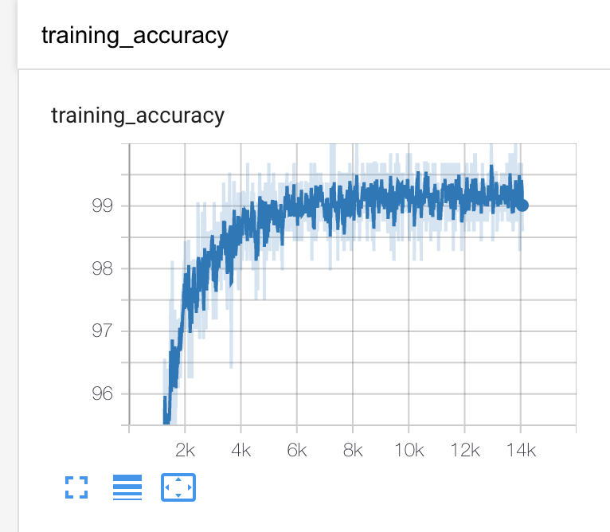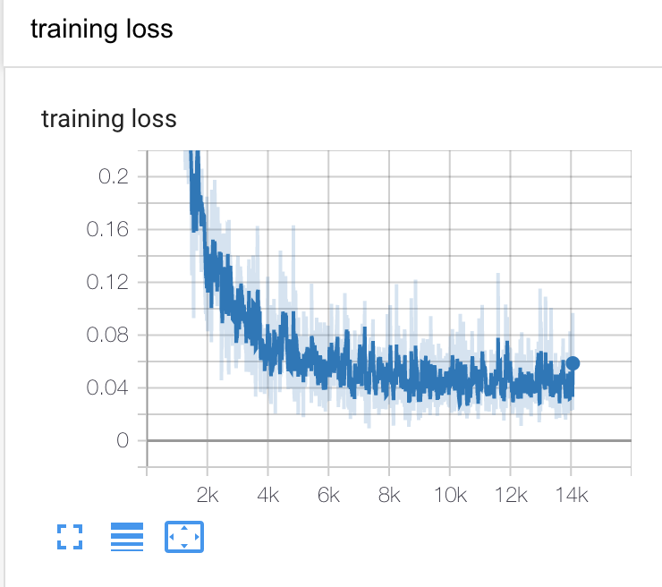

##### 网络分析（bs=64）

use_cuda profile

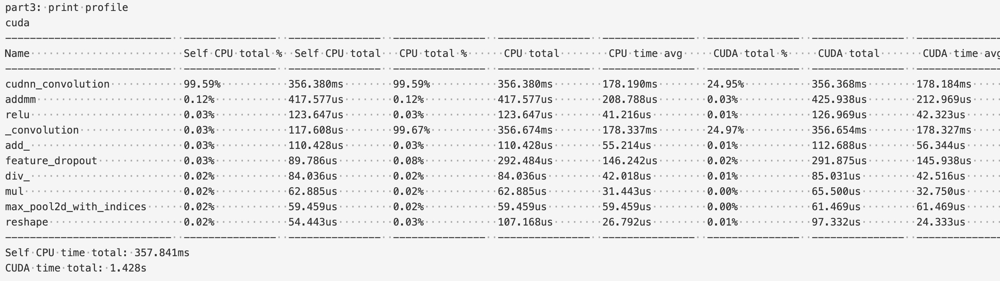

use_cpu profile

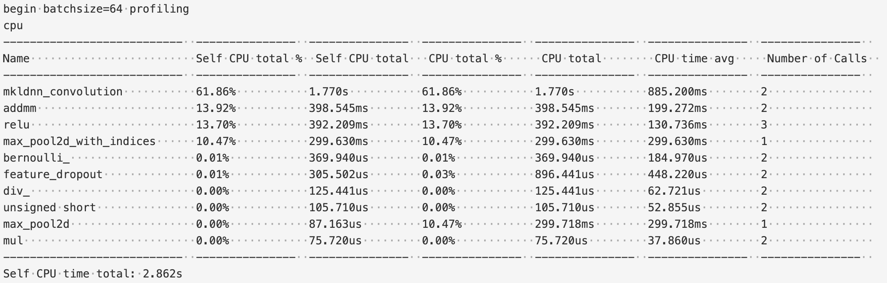

可见，大部分时间都花在了卷积层上，同时，使用CPU和GPU得到的结果也不一样。具体分析见后。

#### 2.网络分析

##### On macOS

|||
|------|--------------|
|批大小 &nbsp;| &nbsp; &nbsp; &nbsp; &nbsp; &nbsp; local test on MacBook &nbsp; &nbsp; &nbsp; &nbsp; &nbsp; |
|<br/>&nbsp;<br/>1<br/>&nbsp;<br/>&nbsp;|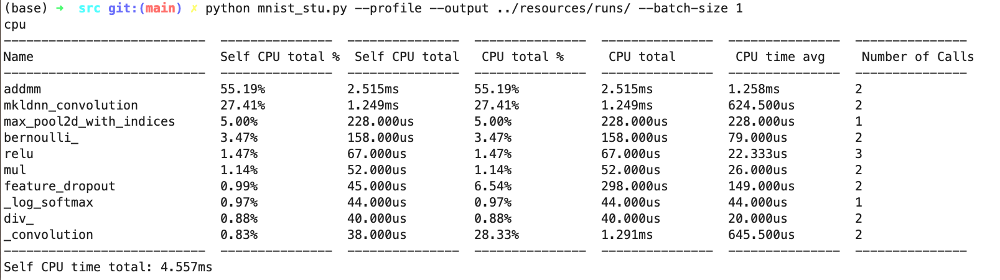|
|<br/>&nbsp;<br/>16<br/>&nbsp;<br/>&nbsp;|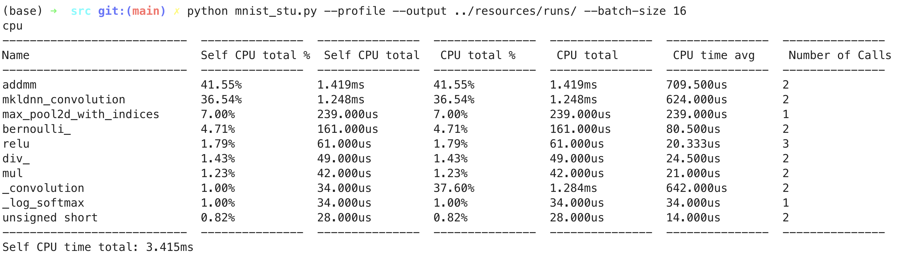|
|<br/>&nbsp;<br/>64<br/>&nbsp;<br/>&nbsp;|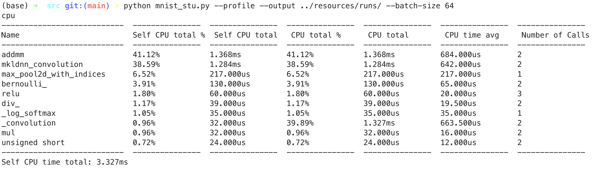|
|||

##### On bitahub (with CPU)

|||
|------|--------------|
|批大小 &nbsp;| &nbsp; &nbsp; &nbsp; &nbsp; &nbsp; 结果比较 &nbsp; &nbsp; &nbsp; &nbsp; &nbsp; |
|<br/>&nbsp;<br/>1<br/>&nbsp;<br/>&nbsp;|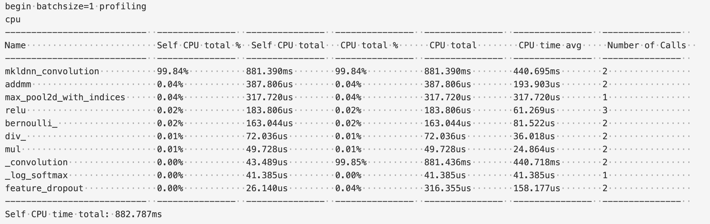|
|<br/>&nbsp;<br/>16<br/>&nbsp;<br/>&nbsp;|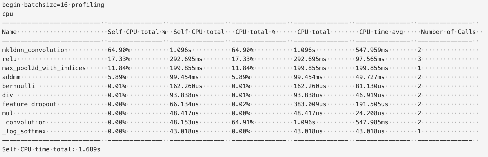|
|<br/>&nbsp;<br/>64<br/>&nbsp;<br/>&nbsp;|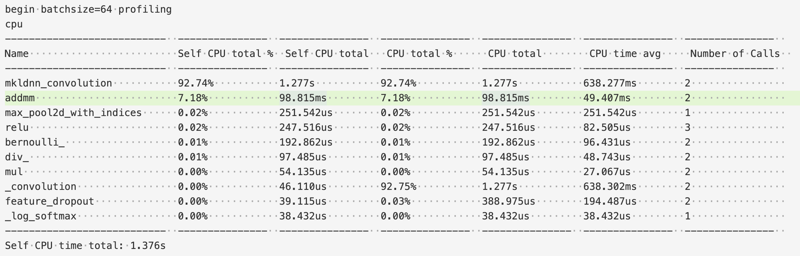|
|||

##### On bitahub (with GPU)

|||
|------|--------------|
|批大小 &nbsp;| &nbsp; &nbsp; &nbsp; &nbsp; &nbsp; 结果比较 &nbsp; &nbsp; &nbsp; &nbsp; &nbsp; |
|<br/>&nbsp;<br/>1<br/>&nbsp;<br/>&nbsp;|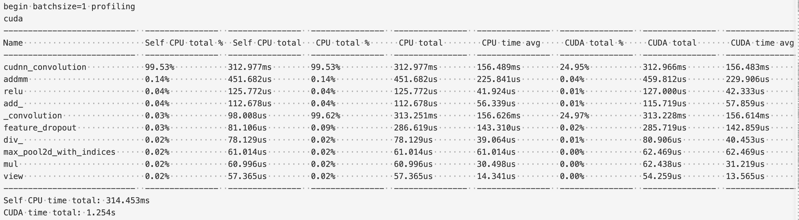|
|<br/>&nbsp;<br/>16<br/>&nbsp;<br/>&nbsp;|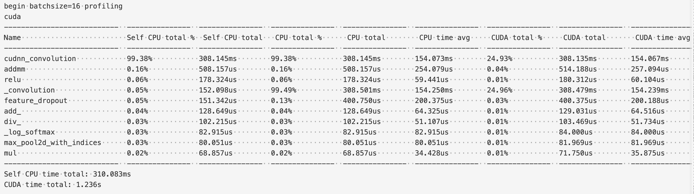|
|<br/>&nbsp;<br/>64<br/>&nbsp;<br/>&nbsp;|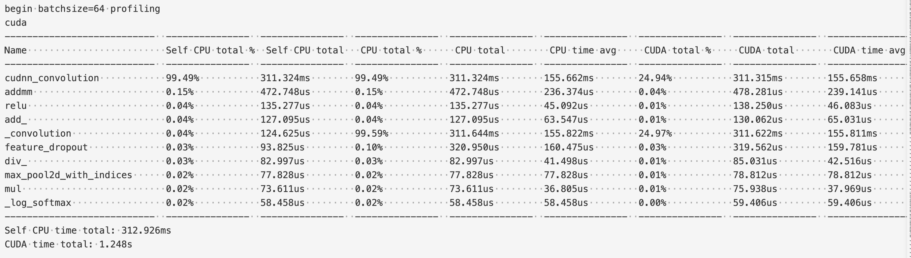|
|||

##### On bitahub (with GPU after train)

bs=1训练起来太慢了。

|||
|------|--------------|
|批大小 &nbsp;| &nbsp; &nbsp; &nbsp; &nbsp; &nbsp; 结果比较 &nbsp; &nbsp; &nbsp; &nbsp; &nbsp; |
|<br/>&nbsp;<br/>16<br/>&nbsp;<br/>&nbsp;|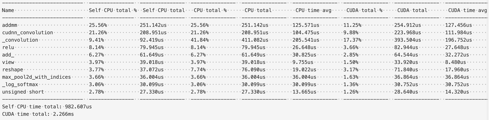|
|<br/>&nbsp;<br/>64<br/>&nbsp;<br/>&nbsp;|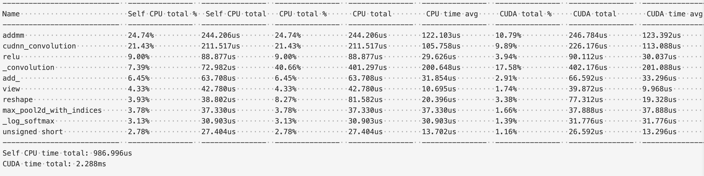|
|||

- 在同配置下，CPU速度会比GPU测试的速度慢。
- 对于CPU来说，花在add层和conv层的时间差不多，但是对于GPU来说conv层花销比add层花销大一个数量级
- 在训练前和训练后对于所耗时间有明显区别，推测是默认模型参数与训练后参数不同导致的差异。