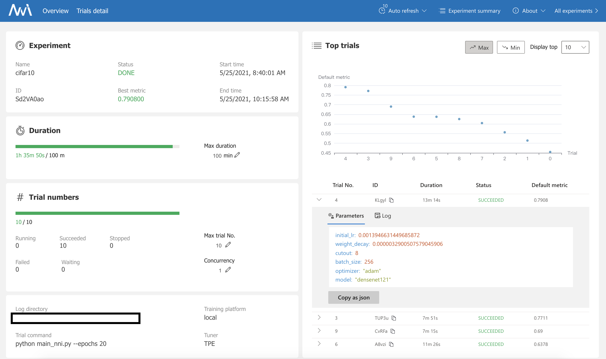
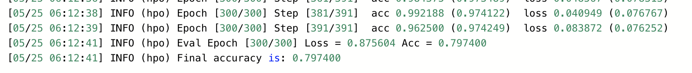
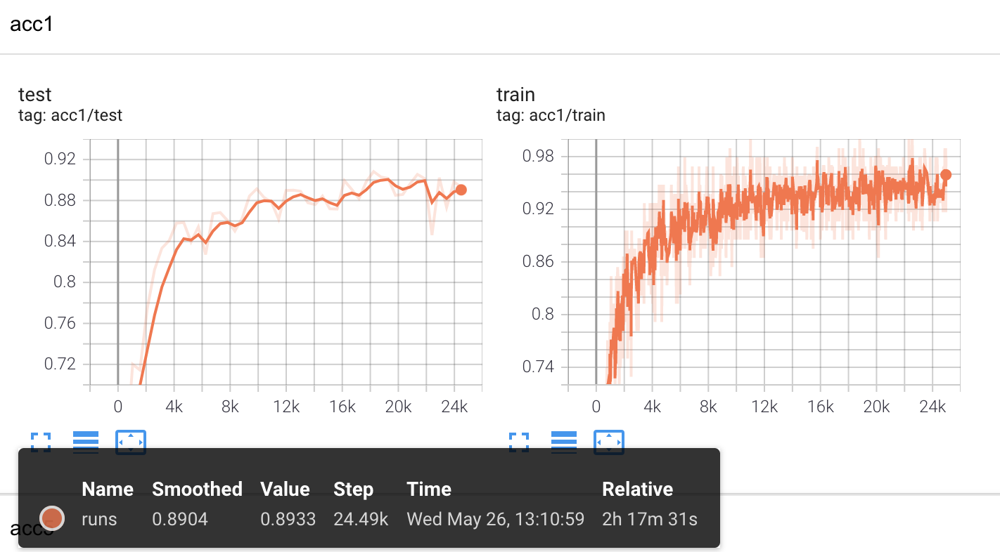

#### 3.WebUI

为了节省运行开销，不对epochs进行搜索，选用了尽可能小的epochs(20)，得到的结果如下



使用模型跑出的结果（参数），去进行测试，但是效果并不良好（下为bitahub output截图）



train的Acc几乎完美但是，test误差很高：过拟合了

那么推测原因是：

- 可见不可以选用很小的epochs数目，否则nni运行出的结果会是在短时间内产生较优效果的参数
- 可见该lr较小（相对人工调参来说），而小学习率容易进入局部最优而过拟合。
- 据此，推测是每个trial训练的epochs太少导致的。

于是调整epochs数目，跑长时间一点试试


#### Extra

使用darts进行网络模型搜索，代码来自于nni的[repo](https://github.com/Microsoft/nni)。首先进行网络参数搜索并进行可视化`nas_darts.py`。


然后使用`retrian.py`重新训练。考虑到默认参数是epochs=600，但根据tensorboard显示，在50时就已经有很好结果，并且比之前的模型(resnet50, densenet121)效果都好(test_accuracy能超过0.9)，就提前终止训练了。



其中，[网络模型](resources/models/epoch_49.json)部分参数如下：

```json
{
  "normal_n2_p0": 2,
  "normal_n2_p1": 3,
  "normal_n2_switch": [
    "normal_n2_p0",
    "normal_n2_p1"
  ],
  "normal_n3_p0": 2,
  "normal_n3_p1": 5,
  "normal_n3_p2": [],
  "normal_n3_switch": [
    "normal_n3_p0",
    "normal_n3_p1"
  ],
    "...": ., 
  "reduce_n5_p0": 0,
  "reduce_n5_p1": [],
  "reduce_n5_p2": [],
  "reduce_n5_p3": 2,
  "reduce_n5_p4": [],
  "reduce_n5_switch": [
    "reduce_n5_p0",
    "reduce_n5_p3"
  ]
}
```


