## 环境

|||Mac (local)|Bitahub|Server|
|--------|--------------|--------------------------|--------------------------|--------------------------|
|硬件环境|CPU（vCPU数目）|6|2|idk|
||GPU(型号，数目)|无|gtx1080Ti，1|A100，1|
|软件环境|OS版本|macOS Catalina|Ubuntu|Ubuntu 20.04|
||深度学习框架<br>python包名称及版本|Pytorch1.5 & Python3.7.4|Pytorch1.5 & Python|Pytorch 1.7 & python 3.8.0|
||CUDA版本|无|10.1|11.0|
||||||
## 实验流程

先进行手动调参，然后使用nni进行调参，最后使用nas进行网络模型搜索。

1. 默认参数及手动调参。（均在bitahub上进行）

   1. 运行样例程序

   2. 编写shell脚本进行手动调参（考虑到时间因素，开了两个任务进行训练，并且只对[lr](src/scripts/try_lr.sh)和[model](src/scripts/try_models.sh)进行训练）

      ```shell
      # e.g. 脚本大概格式
      for lr in 0.01 0.05 0.07
      do
          echo "try lr=$lr"
          python main.py --dataset $dataset --initial_lr $lr
      done
      ```

   3. 根据上述结果，猜测合适的模型和学习率进行训练，保存结果。

2. 使用nni进行参数搜索（因为bitahub无外网IP，也不支持ssh，即无法端口转发；为了能满足实验要求，能有WebUI，借了同学的一台服务器去进行实验）

   1. 向样例代码中添加nni相关指令（[见下](#2Code)）

   2. 编写nni设置文件，设置搜索空间。

   3. 使用`nnictl`创建一个实验开始训练，并通过WebUI了解实验进程

      1. 使用ssh端口映射去在本机上进行观看

         ```shell
         ssh xxx@xxx.xxx.xxx.xxx -L 127.0.0.1:8080:127.0.0.1:8080
         ```

   4. 获取训练后的结果，并重新进行训练

3. 根据参考代码及nni的repo的代码，进行网络架构搜索。（在bitahub上进行）

## 实验结果

#### 1.overview

||||
|---------|-----------------|------------|
| 调参方式 | &nbsp; &nbsp; 超参名称和设置值 &nbsp; &nbsp; | &nbsp; &nbsp; 模型准确率 &nbsp; &nbsp; |
| &nbsp; <br /> &nbsp; 原始代码 &nbsp; <br /> &nbsp; |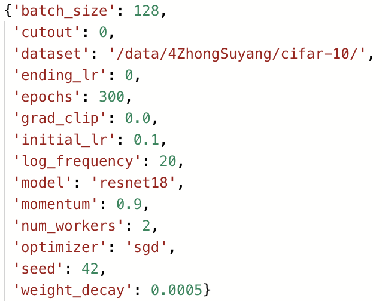|0.8484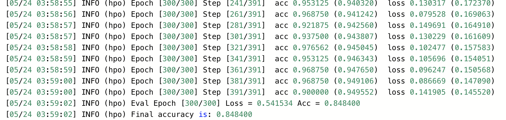|
| &nbsp; <br /> &nbsp; 手动调参 &nbsp; <br /> &nbsp; |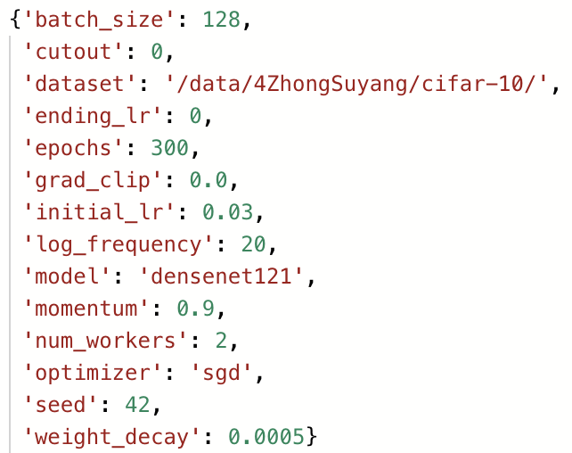|0.8896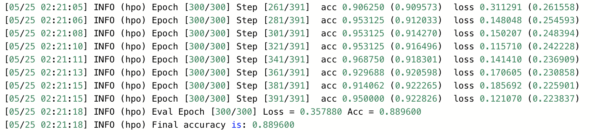|
| &nbsp; <br /> &nbsp; NNI自动调参 &nbsp; <br /> &nbsp; |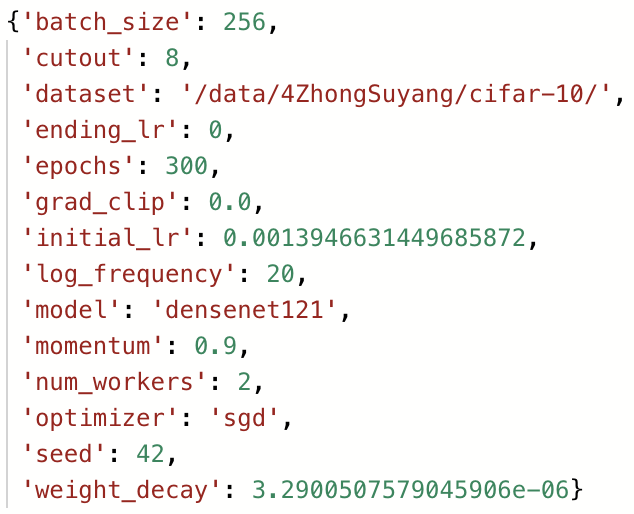|0.7663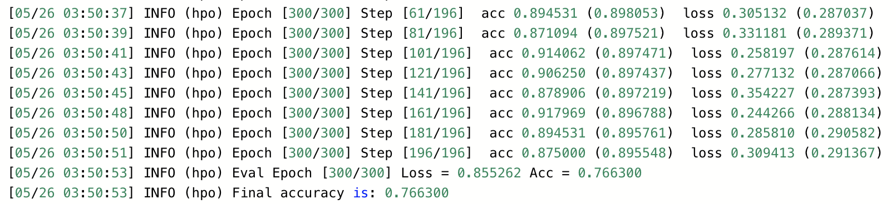|
| &nbsp; <br /> &nbsp; 网络架构搜索 <br />&nbsp; &nbsp; （可选） <br /> &nbsp; |见后|0.8956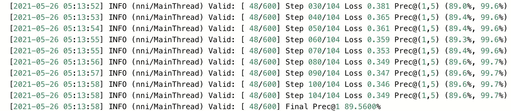|
||||

#### 2.Code

#### 3.WebUI

为了节省运行开销，不对epochs进行搜索，选用了尽可能小的epochs(20)，得到的结果如下


使用模型跑出的结果（参数），去进行测试，但是效果并不良好（下为bitahub output截图）

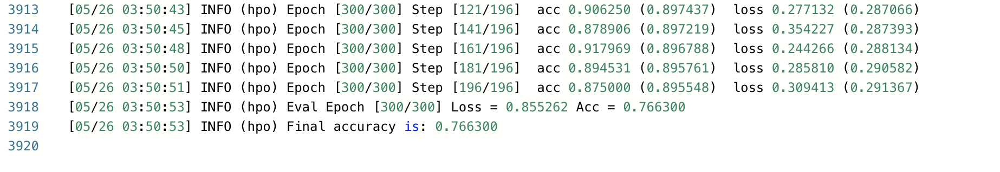

train的Acc较高但是，test的acc不高：过拟合了，而调整epochs数目，减少运行时间效果更差。

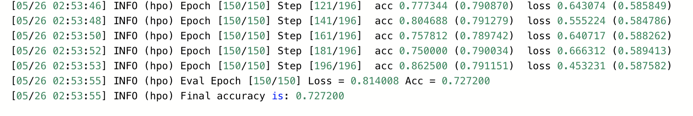

那么推测原因是：

- 可见不可以选用很小的epochs数目，否则nni运行出的结果会是在短时间内产生较优效果的参数
- 可见该lr较小（相对人工调参来说），而小学习率容易进入局部最优而过拟合。
- 据此，推测是每个trial训练的epochs太少导致的。

于是调整epochs数目，每个trial跑长时间一点试试

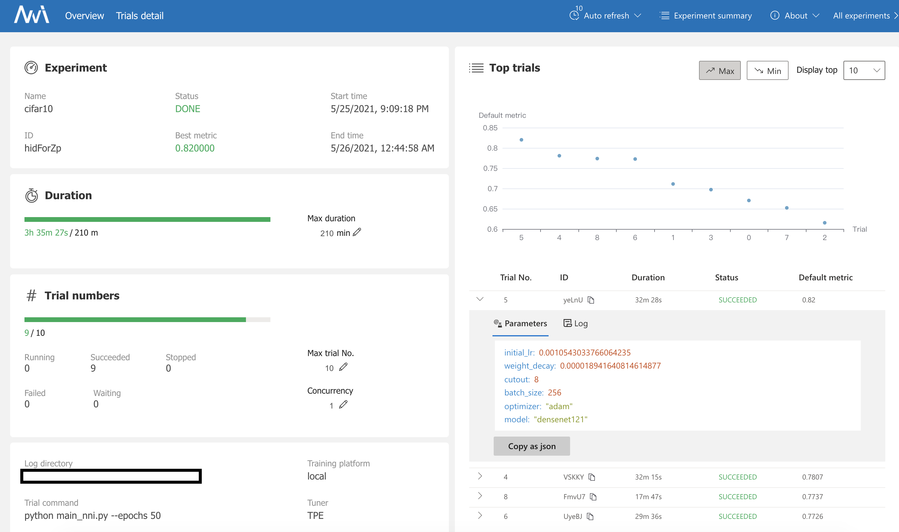

发现得到最好metrics的参数和之前的差不多，可想而知效果并不良好。但是如果使用最后的trial的参数组去进行训练和测试，却能得到很好的效果。如下所示：

| 参数                                                         | 结果                                                         |
| ------------------------------------------------------------ | ------------------------------------------------------------ |
| 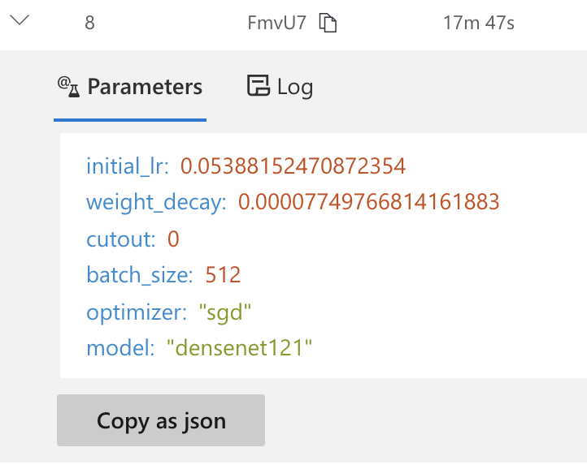 | 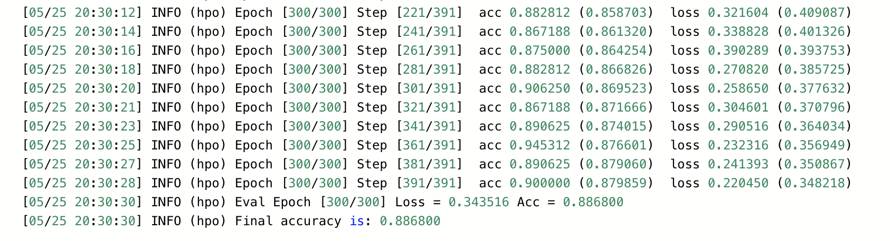 |

#### Extra

使用darts进行网络模型搜索，代码来自于nni的[repo](https://github.com/Microsoft/nni)。首先进行网络参数搜索并进行可视化`nas_darts.py`。


然后使用`retrian.py`重新训练。考虑到默认参数是epochs=600，但根据tensorboard显示，在50时就已经有很好结果，并且比之前的模型(resnet50, densenet121)效果都好(test_accuracy能超过0.9)，就提前终止训练了。


其中，[网络模型](resources/models/epoch_49.json)部分参数如下：

```json
{
  "normal_n2_p0": 2,
  "normal_n2_p1": 3,
  "normal_n2_switch": [
    "normal_n2_p0",
    "normal_n2_p1"
  ],
  "normal_n3_p0": 2,
  "normal_n3_p1": 5,
  "normal_n3_p2": [],
  "normal_n3_switch": [
    "normal_n3_p0",
    "normal_n3_p1"
  ],
    "...": ., 
  "reduce_n5_p0": 0,
  "reduce_n5_p1": [],
  "reduce_n5_p2": [],
  "reduce_n5_p3": 2,
  "reduce_n5_p4": [],
  "reduce_n5_switch": [
    "reduce_n5_p0",
    "reduce_n5_p3"
  ]
}
```


